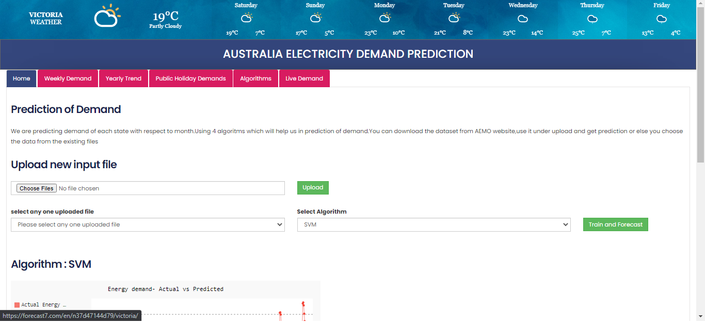

# Deakin Energy (AEMO)
This is a project that I did under SIT764. A web application made using the flask framework. After you upload a CSV from AEMO, you can visualize the performance of different aglorithms on predicting the energy demand. I worked on decision tree algorithm. Also the design, coding and the integration of the tabs yearly trends, public holiday demand and live demand were done by me.

Steps to get started with the Deakin Energy Application

Clone the repository using the link

Open cmd and browse to the root directory.

In your cmd, type "install" + Enter { This would run the bat file to create the virtual environment and activate it }

Run " pip install -r requirements.txt" to install all the essential packages required to run the application.

After the installation of the requirements, use the command "python main.py" to run the project.

The website has been hosted at: https://deakinenergy.azurewebsites.net/

## Preview of the web application:

## Preview of SVM algorithm performance on the data:

## Monthly Energy Consumption Trends for Victoria:

## Energy demand on Public Holidays:

## Live energy demand:

